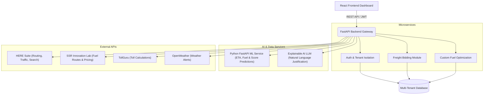
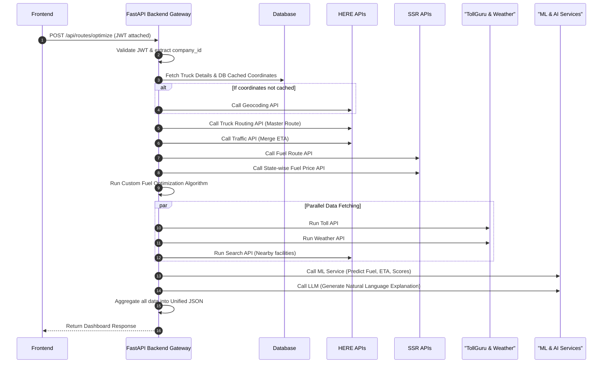

<div align="center">
  <h1>🚛 FleetPilot AI</h1>
  <p><strong>Intelligent Multi-Tenant Logistics & Route Optimization Platform</strong></p>

  
  
  
  
</div>

Welcome to **FleetPilot AI**, an enterprise-grade logistics orchestration platform designed to drastically reduce fuel costs, optimize routing, and provide complete operational intelligence through custom Machine Learning models and unified API orchestration.

---

## 🌟 Key Features

*   **🏢 Strict Multi-Tenant Isolation**: Each logistics company operates in a completely isolated workspace. Backend middleware intercepts all requests and enforces database-level tenant scoping to ensure no cross-company data leakage.
*   **🛣️ Advanced Route & Fuel Optimization**: Powered by **HERE Geocoding & Truck Routing**, keeping strict adherence to vehicle dimensions, weight, and hazmat rules. Integrates real-time **HERE Traffic** events.
*   **⛽ Proprietary Fuel Engine**: Analyzes base fuel estimates (via SSR) against real-time state-wise pricing to calculate exactly **where** and **how much** fuel to purchase to maximize savings.
*   **Context-Aware Operations**: Seamlessly integrates **TollGuru** (cash/FASTag breakdowns), **OpenWeather** (alerts & risk adjustments), and **HERE Search** (nearby mechanic/parking facilities).
*   **📦 Freight Bidding Platform**: An independent module for load creation, carrier bidding, and vendor selection. It operates independently while sharing the core secure backend ecosystem and database.

---

## 🏗️ Architecture Overview

The platform is built on a strict microservices architecture. The backend acts as an **Orchestration Gateway**, ensuring high security, fault tolerance, and code maintainability. The frontend **never** communicates directly with 3rd-party APIs.



---

## 🤖 AI & Machine Learning Integration

FleetPilot AI doesn't just route; it learns and explains its decisions.

### 1. Predictive ML Microservice (Python FastAPI)
Operating entirely independently from third-party AI providers, this internal engine uses historical data to predict operational outcomes:
*   **Actual Fuel Consumption**: Refining API estimates based on historical vehicle/driver performance.
*   **Statistical Delay Probability**: Based on weather severity and historical traffic patterns.
*   **Driver & Vendor Efficiency Scores**: For continuous performance monitoring.
*   **Expected Freight Bid Pricing**: Assisting dispatchers in the Freight Bidding Platform.

### 2. Explainable AI Service (LLM)
An optional service that provides transparent, natural-language reasoning for complex optimization algorithms.
*   **Human-Readable Justification**: *Example: "Route B was selected because it reduces fuel cost by ₹920, avoids heavy traffic on I-5, and reduces total travel time by 28 minutes."*
*   **Non-Blocking Architecture**: Core business logic never depends on this service. If the LLM provider fails, the platform continues operating smoothly.

---

## 🔄 The Optimization Workflow

How a single click on **"Optimize Route"** orchestrates the entire platform:



---

## 🚀 Quick Setup

### Prerequisites
*   Node.js (v18+)
*   Python (v3.9+)
*   API Keys (HERE, TollGuru, OpenWeather, SSR)

### 1. Clone Repository
```bash
git clone https://github.com/your-username/fleetpilot-ai.git
cd fleetpilot-ai
```

### 2. Backend Gateway (FastAPI)
```bash
cd backend
# Create and activate virtual environment
python -m venv venv
venv\Scripts\activate
# Install requirements
pip install -r requirements.txt
# Configure .env with DB and API keys
uvicorn main:app --reload
```

### 3. Frontend Dashboard
```bash
cd frontend
npm install
npm start
```

### 4. ML Prediction Service
```bash
cd ml_service
pip install -r requirements.txt
uvicorn main:app --reload
```

---
<div align="center">
  <i>Built for the future of Logistics.</i>
</div>
